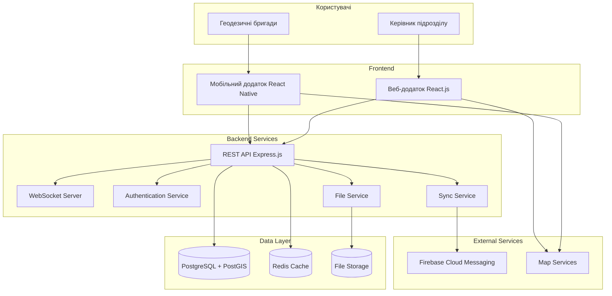

# Архітектура системи управління геодезичними бригадами

## Загальна архітектура



## Компоненти системи

### 1. Frontend (Веб-додаток керівника)

**Технології:**
- React.js 18+ + TypeScript
- Material-UI для UI компонентів
- Leaflet для інтерактивних карт
- Redux Toolkit для управління станом

**Ключові модулі:**
```typescript
src/
├── components/          # Переспроектні компоненти
├── pages/              # Сторінки додатка
├── store/              # Redux store та слайси
├── services/           # API сервіси
├── hooks/              # Custom React hooks
├── utils/              # Утилітарні функції
└── types/              # TypeScript типи
```

### 2. Mobile (Мобільний додаток бригад)

**Технології:**
- React Native 0.72+
- React Navigation для навігації
- React Native Maps для карт
- WatermelonDB для офлайн зберігання
- Firebase Cloud Messaging

**Архітектура:**
```typescript
src/
├── screens/            # Екрани додатка
├── components/         # Компоненти
├── navigation/         # Навігаційна структура
├── database/           # WatermelonDB моделі
├── services/           # API та утилітарні сервіси
├── store/              # Локальний стан
└── utils/              # Допоміжні функції
```

### 3. Backend API

**Технології:**
- Node.js + TypeScript
- Express.js фреймворк
- Prisma ORM
- JWT для автентифікації
- WebSocket для real-time

**Структура:**
```typescript
src/
├── controllers/        # HTTP контролери
├── services/           # Бізнес логіка
├── models/             # Prisma моделі
├── middleware/         # Express middleware
├── routes/             # API роути
├── websocket/          # WebSocket handlers
├── utils/              # Утилітарні функції
└── types/              # TypeScript типи
```

## База даних

### PostgreSQL + PostGIS схема

```sql
-- Користувачі
CREATE TABLE users (
    id UUID PRIMARY KEY DEFAULT gen_random_uuid(),
    email VARCHAR(255) UNIQUE NOT NULL,
    password_hash VARCHAR(255) NOT NULL,
    role user_role NOT NULL,
    name VARCHAR(255) NOT NULL,
    phone VARCHAR(20),
    created_at TIMESTAMPTZ DEFAULT NOW(),
    updated_at TIMESTAMPTZ DEFAULT NOW()
);

-- Бригади
CREATE TABLE teams (
    id UUID PRIMARY KEY DEFAULT gen_random_uuid(),
    name VARCHAR(255) NOT NULL,
    leader_id UUID REFERENCES users(id),
    status team_status DEFAULT 'active',
    created_at TIMESTAMPTZ DEFAULT NOW(),
    updated_at TIMESTAMPTZ DEFAULT NOW()
);

-- Об'єкти з геопросторовими даними
CREATE TABLE sites (
    id UUID PRIMARY KEY DEFAULT gen_random_uuid(),
    name VARCHAR(255) NOT NULL,
    address TEXT,
    coordinates GEOMETRY(POINT, 4326) NOT NULL,
    description TEXT,
    client_info JSONB,
    created_at TIMESTAMPTZ DEFAULT NOW()
);

-- Завдання
CREATE TABLE tasks (
    id UUID PRIMARY KEY DEFAULT gen_random_uuid(),
    site_id UUID REFERENCES sites(id),
    team_id UUID REFERENCES teams(id),
    title VARCHAR(255) NOT NULL,
    description TEXT,
    priority task_priority DEFAULT 'medium',
    status task_status DEFAULT 'pending',
    scheduled_date TIMESTAMPTZ,
    estimated_duration INTERVAL,
    created_by UUID REFERENCES users(id),
    created_at TIMESTAMPTZ DEFAULT NOW(),
    updated_at TIMESTAMPTZ DEFAULT NOW(),
    completed_at TIMESTAMPTZ
);

-- Індекси для оптимізації
CREATE INDEX idx_sites_coordinates ON sites USING GIST (coordinates);
CREATE INDEX idx_tasks_status ON tasks (status);
CREATE INDEX idx_tasks_scheduled_date ON tasks (scheduled_date);
CREATE INDEX idx_tasks_team_id ON tasks (team_id);
```

## API специфікація

### Основні ендпоінти

```typescript
// Автентифікація
POST   /api/auth/login          # Вхід в систему
POST   /api/auth/logout         # Вихід з системи
POST   /api/auth/refresh        # Оновлення токена

// Завдання
GET    /api/tasks               # Список завдань
GET    /api/tasks/:id           # Деталі завдання
POST   /api/tasks               # Створення завдання
PUT    /api/tasks/:id           # Оновлення завдання
DELETE /api/tasks/:id           # Видалення завдання

// Звіти
POST   /api/tasks/:id/reports   # Створення звіту
PUT    /api/reports/:id         # Оновлення звіту
POST   /api/reports/:id/files   # Завантаження файлів

// Бригади
GET    /api/teams               # Список бригад
GET    /api/teams/:id/members   # Учасники бригади
PUT    /api/teams/:id/location  # Оновлення локації

// WebSocket події
task:created                    # Нове завдання
task:updated                    # Оновлення завдання
team:location                   # Локація бригади
notification:new                # Нове сповіщення
```

## Безпека

### Автентифікація та авторизація
- JWT токени з коротким терміном дії (15 хв)
- Refresh токени (7 днів)
- RBAC (Role-Based Access Control)
- Rate limiting для API

### Шифрування
- HTTPS/TLS 1.3 для всіх з'єднань
- bcrypt для хешування паролів
- Шифрування файлів в сховищі

### Валідація
- Input validation на всіх рівнях
- SQL injection захист через Prisma ORM
- XSS захист через CSP headers

## Продуктивність

### Кешування
- Redis для сесій та часто використовуваних даних
- Client-side кешування в браузері
- CDN для статичних файлів

### База даних
- Геопросторові індекси для швидкого пошуку
- Connection pooling
- Database sharding при необхідності

### Моніторинг
- Prometheus metrics
- Grafana дашборди
- ELK stack для логів
- Health checks для всіх сервісів

## Розгортання

### Docker контейнеризація
```yaml
services:
  api:
    build: ./backend
    ports: ["3000:3000"]
    depends_on: [postgres, redis]
    
  frontend:
    build: ./frontend
    ports: ["80:80"]
    
  postgres:
    image: postgis/postgis:15-3.3
    
  redis:
    image: redis:7-alpine
```

### Середовища
- **Development:** Локальний Docker Compose
- **Staging:** AWS ECS / Google Cloud Run
- **Production:** Kubernetes кластер

## Масштабованість

### Горизонтальне масштабування
- Load balancer для API серверів
- Database читання репліки
- Microservices архітектура в майбутньому

### Вертикальне масштабування
- CPU/Memory оптимізація
- Database tuning
- Redis кластер для великих навантажень