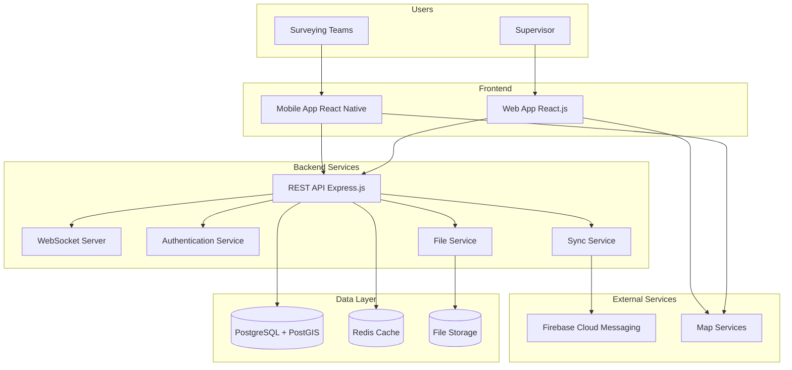

# Surveying Team Management System Architecture

## System Overview



## System Components

### 1. Frontend (Supervisor Web App)

**Technologies:**
- React.js 18+ + TypeScript
- Material-UI for UI components
- Leaflet for interactive maps
- Redux Toolkit for state management

**Key modules:**
```typescript
src/
├── components/          # Reusable components
├── pages/              # Application pages
├── store/              # Redux store and slices
├── services/           # API services
├── hooks/              # Custom React hooks
├── utils/              # Utility functions
└── types/              # TypeScript types
```

### 2. Mobile (Field Teams App)

**Technologies:**
- React Native 0.72+
- React Navigation for navigation
- React Native Maps for maps
- WatermelonDB for offline storage
- Firebase Cloud Messaging

**Architecture:**
```typescript
src/
├── screens/            # App screens
├── components/         # Components
├── navigation/         # Navigation structure
├── database/           # WatermelonDB models
├── services/           # API and utility services
├── store/              # Local state
└── utils/              # Helper functions
```

### 3. Backend API

**Technologies:**
- Node.js + TypeScript
- Express.js framework
- Prisma ORM
- JWT for authentication
- WebSocket for real-time

**Structure:**
```typescript
src/
├── controllers/        # HTTP controllers
├── services/           # Business logic
├── models/             # Prisma models
├── middleware/         # Express middleware
├── routes/             # API routes
├── websocket/          # WebSocket handlers
├── utils/              # Utility functions
└── types/              # TypeScript types
```

## Database

### PostgreSQL + PostGIS Schema

```sql
-- Users
CREATE TABLE users (
    id UUID PRIMARY KEY DEFAULT gen_random_uuid(),
    email VARCHAR(255) UNIQUE NOT NULL,
    password_hash VARCHAR(255) NOT NULL,
    role user_role NOT NULL,
    name VARCHAR(255) NOT NULL,
    phone VARCHAR(20),
    created_at TIMESTAMPTZ DEFAULT NOW(),
    updated_at TIMESTAMPTZ DEFAULT NOW()
);

-- Teams
CREATE TABLE teams (
    id UUID PRIMARY KEY DEFAULT gen_random_uuid(),
    name VARCHAR(255) NOT NULL,
    leader_id UUID REFERENCES users(id),
    status team_status DEFAULT 'active',
    created_at TIMESTAMPTZ DEFAULT NOW(),
    updated_at TIMESTAMPTZ DEFAULT NOW()
);

-- Sites with geospatial data
CREATE TABLE sites (
    id UUID PRIMARY KEY DEFAULT gen_random_uuid(),
    name VARCHAR(255) NOT NULL,
    address TEXT,
    coordinates GEOMETRY(POINT, 4326) NOT NULL,
    description TEXT,
    client_info JSONB,
    created_at TIMESTAMPTZ DEFAULT NOW()
);

-- Tasks
CREATE TABLE tasks (
    id UUID PRIMARY KEY DEFAULT gen_random_uuid(),
    site_id UUID REFERENCES sites(id),
    team_id UUID REFERENCES teams(id),
    title VARCHAR(255) NOT NULL,
    description TEXT,
    priority task_priority DEFAULT 'medium',
    status task_status DEFAULT 'pending',
    scheduled_date TIMESTAMPTZ,
    estimated_duration INTERVAL,
    created_by UUID REFERENCES users(id),
    created_at TIMESTAMPTZ DEFAULT NOW(),
    updated_at TIMESTAMPTZ DEFAULT NOW(),
    completed_at TIMESTAMPTZ
);

-- Optimization indexes
CREATE INDEX idx_sites_coordinates ON sites USING GIST (coordinates);
CREATE INDEX idx_tasks_status ON tasks (status);
CREATE INDEX idx_tasks_scheduled_date ON tasks (scheduled_date);
CREATE INDEX idx_tasks_team_id ON tasks (team_id);
```

## API Specification

### Main Endpoints

```typescript
// Authentication
POST   /api/auth/login          # System login
POST   /api/auth/logout         # System logout
POST   /api/auth/refresh        # Token refresh

// Tasks
GET    /api/tasks               # Task list
GET    /api/tasks/:id           # Task details
POST   /api/tasks               # Create task
PUT    /api/tasks/:id           # Update task
DELETE /api/tasks/:id           # Delete task

// Reports
POST   /api/tasks/:id/reports   # Create report
PUT    /api/reports/:id         # Update report
POST   /api/reports/:id/files   # Upload files

// Teams
GET    /api/teams               # Team list
GET    /api/teams/:id/members   # Team members
PUT    /api/teams/:id/location  # Update location

// WebSocket events
task:created                    # New task
task:updated                    # Task update
team:location                   # Team location
notification:new                # New notification
```

## Security

### Authentication & Authorization
- JWT tokens with short lifespan (15 min)
- Refresh tokens (7 days)
- RBAC (Role-Based Access Control)
- API rate limiting

### Encryption
- HTTPS/TLS 1.3 for all connections
- bcrypt for password hashing
- File encryption in storage

### Validation
- Input validation at all levels
- SQL injection protection via Prisma ORM
- XSS protection via CSP headers

## Performance

### Caching
- Redis for sessions and frequently used data
- Client-side caching in browser
- CDN for static files

### Database
- Geospatial indexes for fast searches
- Connection pooling
- Database sharding when needed

### Monitoring
- Prometheus metrics
- Grafana dashboards
- ELK stack for logs
- Health checks for all services

## Deployment

### Docker Containerization
```yaml
services:
  api:
    build: ./backend
    ports: ["3000:3000"]
    depends_on: [postgres, redis]
    
  frontend:
    build: ./frontend
    ports: ["80:80"]
    
  postgres:
    image: postgis/postgis:15-3.3
    
  redis:
    image: redis:7-alpine
```

### Environments
- **Development:** Local Docker Compose
- **Staging:** AWS ECS / Google Cloud Run
- **Production:** Kubernetes cluster

## Scalability

### Horizontal Scaling
- Load balancer for API servers
- Database read replicas
- Microservices architecture in the future

### Vertical Scaling
- CPU/Memory optimization
- Database tuning
- Redis cluster for high loads